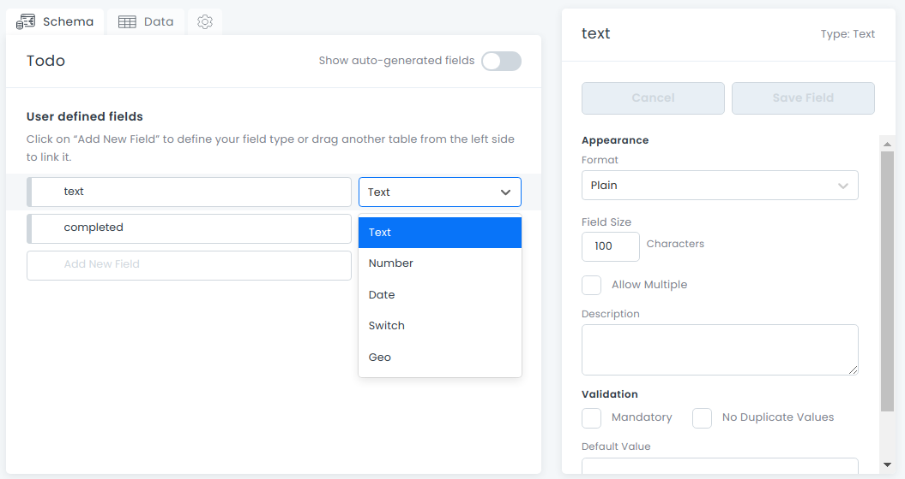
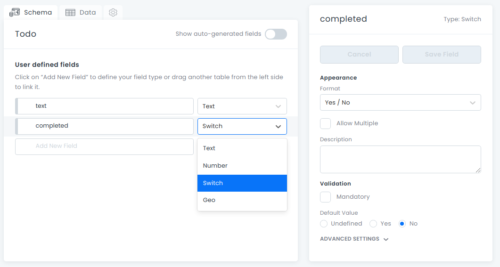

This is a [Next.js](https://nextjs.org/) project bootstrapped with [`create-next-app`](https://github.com/vercel/next.js/tree/canary/packages/create-next-app).

## Getting Started

Primero, configura un workspace de 8base y crear una tabla de todos:

Para obtener los valores de las variables de entorno necesitaras haber creado una [cuenta de 8base](https://app.8base.com/), levantado un workspace y creado una tabla con el nombre "Todo" con los campos "text" de tipo "Text" en formato "Plain"  y "completed" de tipo "Switch" en formato "Yes/No" con un valor por defecto de "No". 

una vez hayas creado la tabla de "todos" tendras un boton "Endpoint" de donde podras obtener el valor para la variable de entorno `NEXT_PUBLIC_8BASE_URL`. las otras variables son el Email y Password de tu cuenta de 8base que seran el valor por defecto de los inputs para iniciar sesión, estas ultimas variables son opcionales.

asegurate de que en la tabla de usuarios tu usuario tenga el rol de administrador.

segundo, renombra al archivo ".env.example" dejando solo ".env" y darles valor a las variables de entorno.

```.env
NEXT_PUBLIC_8BASE_URL= // 8base Endpoint
NEXT_PUBLIC_EMAIL= // Email con el que creaste la cuenta de 8base [Opcional]
NEXT_PUBLIC_PASSWORD= // Password con el que create la cuenta de 8base [Opcional]
```
